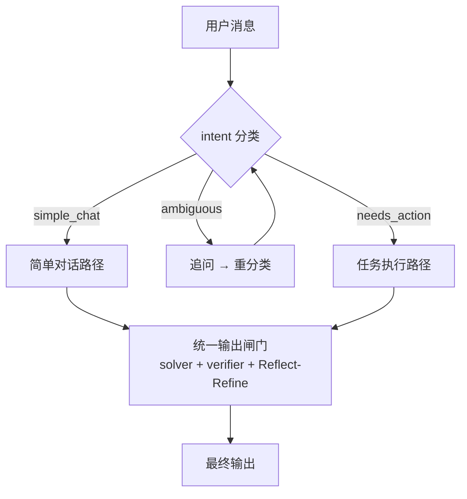
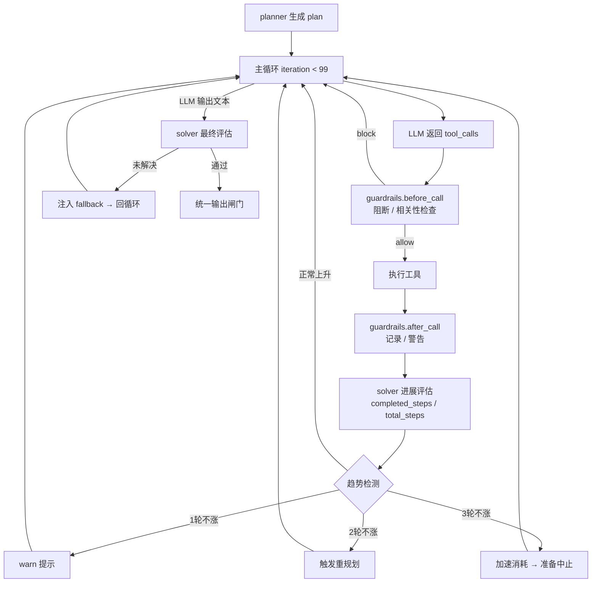
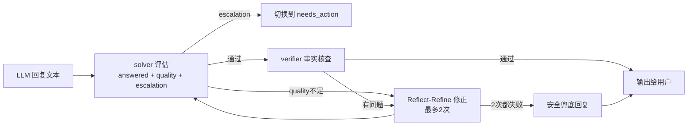

# 082 — Agent 自动控制系统（工程控制论架构升级）

> 状态: 📋 设计中
> 优先级: P0
> T-shirt Size: L
> 录入日期: 2026-06-10
> 来源: 工程控制论分析 — 用控制论框架重构 Agent 为完整的自动控制系统

---

## 问题陈述

当前 Agent 已有闭环结构（intent→planner→执行→solver→verifier），但存在系统性缺陷：

1. **simple_chat 路径是开环的** — 输出不经过 solver/verifier，误分类无法自修正
2. **执行循环缺少过程度量** — 只知道"工具成功/失败"，不知道"离目标还有多远"
3. **MAX_ITERATIONS=10 是硬编码安全网** — 没有基于进展的智能中止
4. **guardrails 只检测重复，不检测偏离** — 工具每次"成功"但与目标无关时不触发
5. **plan 一次性生成不可修正** — 执行环境变化后无法适应

## 用户故事

**As a** 岛主用户
**I want** Agent 在任何路径下都能自动评估输出质量、检测进展、修正错误
**So that** 无论简单对话还是复杂任务，都能得到经过验证的可靠回复

---

## 范围

### In Scope

- **统一输出闸门**：所有路径（simple_chat / ambiguous / needs_action）的输出都经过 solver 评估 + verifier 核查 + Reflect-Refine 修正
- **simple_chat 误分类自修正**：solver 检测到回复需要工具辅助时，自动切换到 needs_action 路径
- **每轮进展度量**：solver 基于 plan.steps 完成度输出 progress_score
- **趋势检测**：guardrails 纯代码检测 progress_score 序列的升/平/降
- **递进式响应**：不涨 1 轮 warn → 2 轮重规划 → 3 轮加速消耗
- **相关性门控**：guardrails.before_call 检查工具是否在 plan.tools_needed 中，不在则注入 warn
- **在线重规划**：planner 支持基于已有执行记录重新生成 steps
- **前端 PROGRESS 标记**：`[PROGRESS:2/3:描述]` 推送给前端
- **MAX_ITERATIONS 放大到 99**：进展度量 + 趋势检测成为主要中止机制

### Out of Scope

- 多 Agent 协调（delegate_task） — 当前单 agent 架构不变
- 变速 budget 消耗的精确数学模型 — 先用简单递进式
- 自动学习 fallback 排序 — 数据积累后再做
- 前端进度条 UI 组件 — 先推标记，前端展示后续迭代

---

## 目标架构

### 图1：总体路由

### 图2：needs_action 核心控制循环

### 图3：统一输出闸门（所有路径共用）

**核心原则：所有路径最终都经过 solver → verifier 闸门，无例外。适当冗余是可靠性基础。**

---

## 验收标准

### 统一输出闸门

1. **AC1**: simple_chat 路径的回复必须经过 solver 评估后才输出，solver 判定 `answered=false` 或 `needs_escalation=true` 时自动切换到 needs_action 路径重新执行
2. **AC2**: solver 判定 `quality` 不足时，触发 Reflect-Refine 循环（最多 2 次修正），2 次仍不通过则输出安全兜底回复
3. **AC3**: ambiguous 路径追问后重分类失败时，退化到 needs_action 路径（不卡死）

### 进展度量

4. **AC4**: needs_action 每轮工具调用后，solver 输出结构化进展评估 `{completed: [...], partial: [...], pending: [...]}`，progress_score = completed_count / total_steps
5. **AC5**: solver 进展评估仅在代码级无法判定时触发（全成功且在 plan.tools_needed 中 → 代码直接计 +1，无需 LLM）。评估失败时退化到当前行为（匀速消耗），不阻塞执行
6. **AC6**: 前端通过 `[PROGRESS:2/3:正在查询数据]` 标记接收进展信息

### 趋势检测与递进响应

7. **AC7**: guardrails 纯代码维护 progress_score 历史序列，检测连续不涨（平台期）或下降（发散）
8. **AC8**: 连续 1 轮不涨 → 注入 warn 提示；连续 2 轮不涨 → 调用 planner 重规划；连续 3 轮不涨 → 加速 budget 消耗
9. **AC9**: 重规划基于已有执行记录（哪些步骤完成了、哪些工具失败了）生成新的 steps 列表，替换原 plan

### 相关性门控

10. **AC10**: guardrails.before_call 检查工具名是否在 plan.tools_needed 列表中，不在则注入 warn 提示"此调用不在计划内"但不阻断执行
11. **AC11**: 计划外工具调用成功且 progress_score 上涨时，warn 不再对后续类似调用重复触发（探索成功则接纳）

### 基础设施

12. **AC12**: MAX_ITERATIONS 从 10 改为 99，进展度量 + 趋势检测成为主要中止机制
13. **AC13**: 所有进展数据（score 序列、重规划次数、warn 次数）记录到日志，供后续分析

### 错误路径

14. **AC14**: solver LLM 调用超时或返回异常时，本轮评估跳过，系统继续执行不中断
15. **AC15**: planner 重规划失败时，保留原 plan 继续执行，不阻塞主循环

---

## 业务价值

- 消除 Agent 空转：有进展度量后，无效循环被提前检测和中止
- 提升回复可靠性：所有路径过闸门，误分类和低质量回复被拦截
- 支撑复杂任务：MAX_ITERATIONS=99 + 智能中止，让 Agent 能处理更长链路的任务
- 为后续优化奠基：进展数据是变速预算、学习型 fallback 的基础设施

---

## 设计决策记录

| # | 决策点 | 结论 | 理由 |
|---|--------|------|------|
| D1 | 评估时机/粒度 | 混合 — 代码级评估每个工具调用，LLM 语义评估每轮一次 | 代码评估零成本可即时阻断；LLM 评估每轮一次控制延迟 |
| D2 | 评估方式 | 混合 — 代码 + 复用 solver 模块（不引入独立 agent） | 当前单 agent 架构，solver 已是独立 LLM call，扩展其职责即可 |
| D3 | 成本控制 | 不追求效率，接受冗余 — 所有路径都走 solver | 控制论原则：冗余是可靠性基础，宁可多验证一次也不放过错误 |
| D4 | solver 输入 | 本轮结果 + plan + 历史 progress 序列 | 控制论要求位置+速度：solver 出分数（位置），guardrails 看趋势（速度） |
| D5 | 分工 | solver 输出 progress_score（位置），guardrails 看趋势（速度/方向） | 各司其职：LLM 判语义，代码判数学趋势 |
| D6 | progress_score 计算 | 步骤映射 — LLM 判断 plan.steps 中哪些已完成 | `score = completed / total`，锚定在 plan 步骤上，比数值打分稳定 |
| D7 | MAX_ITERATIONS | 从 10 放大到 99 | 有进展度量后硬上限只是安全网，系统能自行判断何时该停 |
| D8 | 进展下降响应 | 递进式：warn → 重规划 → 加速消耗（最小干预原则） | 先轻后重，不过度干预可能正在慢收敛的过程 |
| D9 | 前端展示 | `[PROGRESS:2/3:描述]` 显式标记 | 和现有 [TOOL:xxx] 模式一致，信息完整 |
| D10 | 计划外调用 | warn 提示，不阻断（对偶控制原则） | 允许有意义的探索，LLM 自行判断是否收回 |
| D11 | simple_chat 路径 | 也走 solver — 评估 answered + quality + needs_escalation | 所有输出都必须过闸门，无例外 |
| D12 | simple_chat solver 判定"不好"时 | 复用 Reflect-Refine 修正循环（最多 2 次） | 机制已存在，统一所有路径的修正策略 |
| D13 | needs_escalation | simple_chat 的 solver 发现需要工具才能回答 → 切换到 needs_action | 模式切换 — 前馈分类错误时的自修正 |
| D14 | 082 范围 | 完整自动控制系统，一次性交付，不分期 | 所有路径闭环，用控制论重构 agent 全流程 |

---

## 控制论概念映射

| 控制论术语 | 082 实现 |
|---|---|
| 前馈控制 | intent 分类 + planner 预规划 |
| 闭环反馈 | solver 每轮评估 → 趋势检测 → 递进响应 |
| 观测器 | solver（语义）+ verifier（代码级事实核查） |
| 限幅器 / 积分饱和保护 | guardrails 阻断 + MAX_ITERATIONS=99 安全网 |
| 自适应 / 在线辨识 | 重规划（基于执行记录更新 plan） |
| 扰动抑制 | 相关性门控（偏离计划 → warn） |
| 模式切换 | needs_escalation（simple_chat → needs_action） |
| 对偶控制 | 计划外调用不阻断，允许探索但有代价 |
| 最小干预 | 递进式响应（warn → replan → accelerate） |
| 有限时间稳定性 | MAX_ITERATIONS=99 硬上限 |
| 冗余观测 | 所有路径都过 solver，不追求机制效率 |

---

## 影响的文件

| 文件 | 改动类型 | 说明 |
|------|---------|------|
| `agent.py` | 重构 | 主循环接入 solver 每轮评估；simple_chat 路径加闸门；MAX_ITERATIONS=99 |
| `agent_solver.py` | 重写 | 从二值判断扩展为：进展评估 + 质量评估 + 模式切换判断 |
| `agent_guardrails.py` | 扩展 | 新增 progress 趋势检测 + 相关性门控 |
| `agent_planner.py` | 扩展 | 支持重规划（接收已有执行记录，输出新 steps） |
| `agent_verifier.py` | 微调 | 统一为所有路径的闸门组件（已有逻辑基本不变） |
| 前端 JS | 新增 | 解析 `[PROGRESS:x/y:desc]` 标记并展示 |

---

## 依赖

- #079 Agent Guardrails（已完成）
- #080 意图识别 + 规划器（已完成）
- #081 目标验证 + Solver（已完成）
- config 系统（无新增配置项，MAX_ITERATIONS 硬编码在 agent.py）
